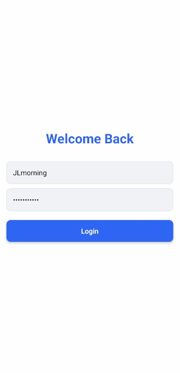
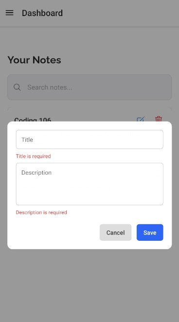

# 📝 RBS Note – React Native Note-Taking App

RBS Note is a simple and modern mobile note-taking application built using **React Native**, **Expo**, **Redux Toolkit**, and **TypeScript**. It provides core note management features such as **create**, **read**, **update**, and **delete (CRUD)** with a smooth and responsive UI experience.

---

## 🚀 Features Implemented

- 🔐 **Authentication System**
  - Hardcoded login with validation (`username: test`, `password: password123`)
  - Welcome messages vary for new vs. returning users
  - Protected routes using Redux state

- 📋 **Note Management (CRUD)**
  - Add, edit, and delete notes
  - Editable modals with validation using **Zod**
  - Each note includes a title and description

- 🔍 **Search Functionality**
  - Real-time filtering of notes by title or description

- 🗂️ **Empty State UI**
  - Friendly prompt for first-time users with quick access to note creation

- 🎨 **Modern UI/UX**
  - Vector icons from `react-native-vector-icons`
  - Responsive layout and modern card design
  - Floating Action Button (FAB) for adding notes

- 📂 **Reusable Components**
  - `AppText`, `AppIcon`, `SearchBar`, `EmptyState`, `NoteItem`, etc.

---

## 🧑‍💻 Tech Stack

- **React Native** + **Expo**  
- **TypeScript**
- **Redux Toolkit**  
- **Zod** (for validation)
- **react-native-vector-icons**
- **react-native-uuid**

---

## 📸 Screenshots

| Login Screen | Notes Dashboard | Add/Edit Modal |
|--------------|------------------|----------------|
|  |  |  |


---

## 🛠️ Setup Instructions

1. **Clone the repository**

```bash
git clone https://github.com/YuriMorning7/RBS-Note.git
cd RBS-Note
